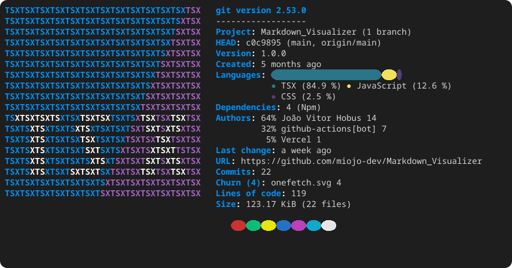

# Markdown Vizualizer

simple project using React, making a visualizer/interpreter for markdown files

---
## Production
The project can be seen working on: https://markdown-webeditor.vercel.app/

---
## 🧪 Some Technologies I've Used

  
  
  
  
  

<!-- ONEFETCH_START -->

<!-- ONEFETCH_END -->
